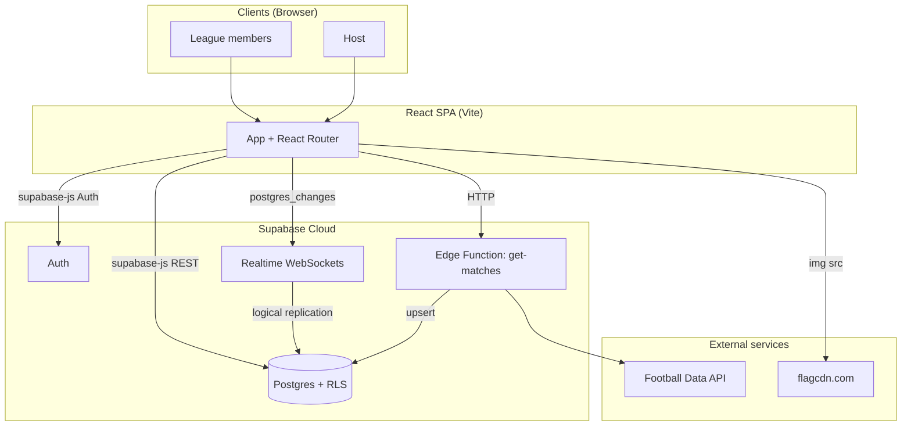
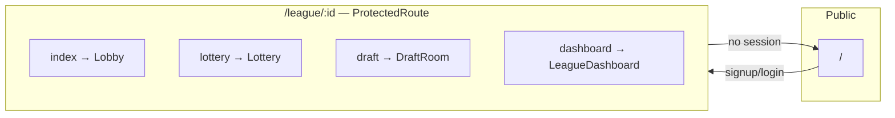
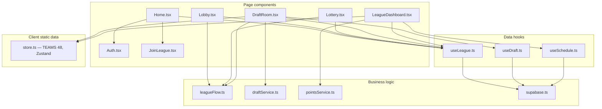
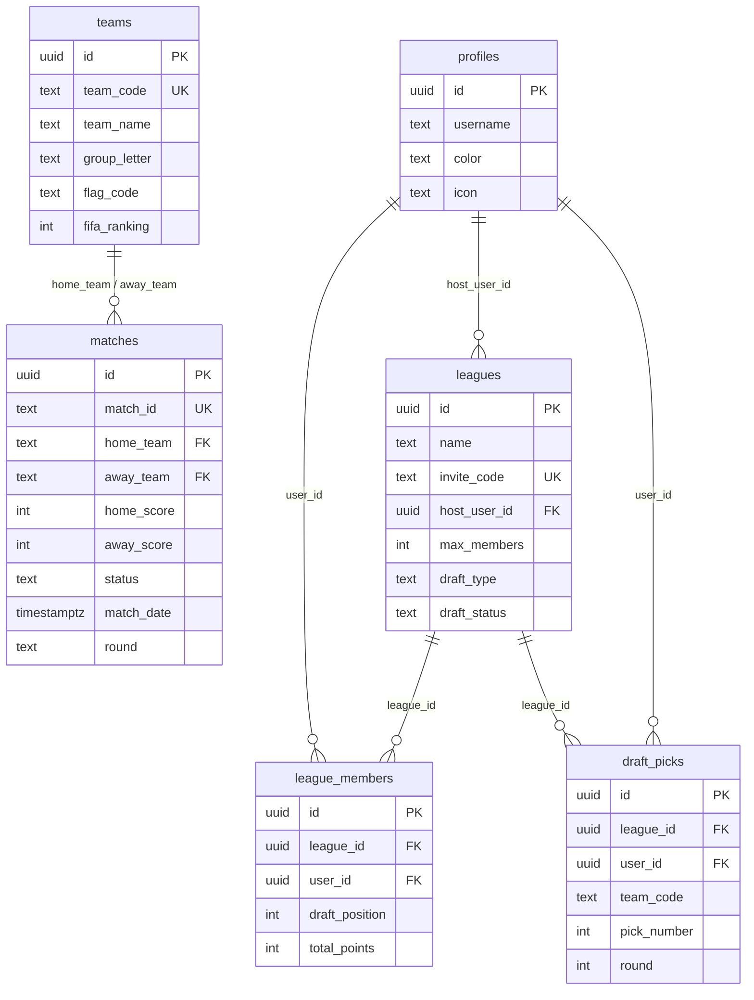
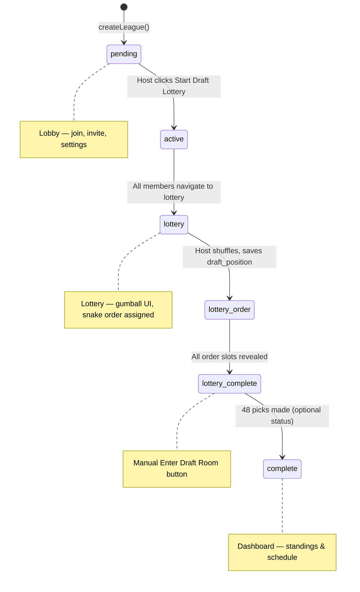
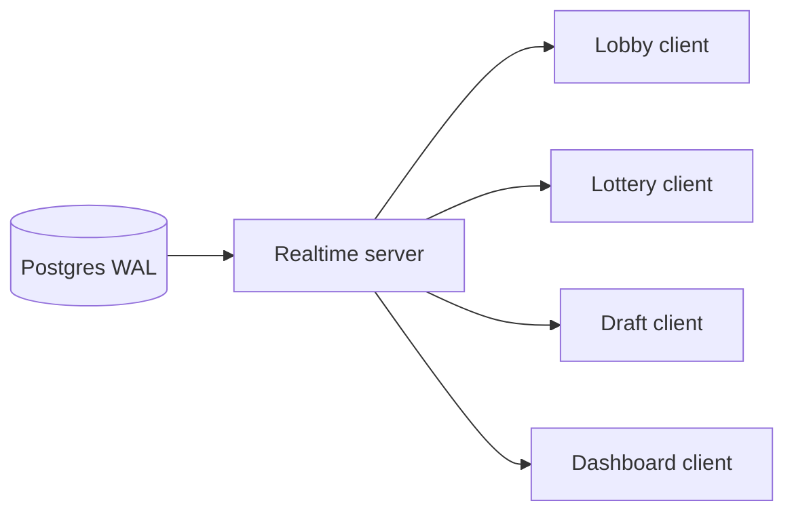
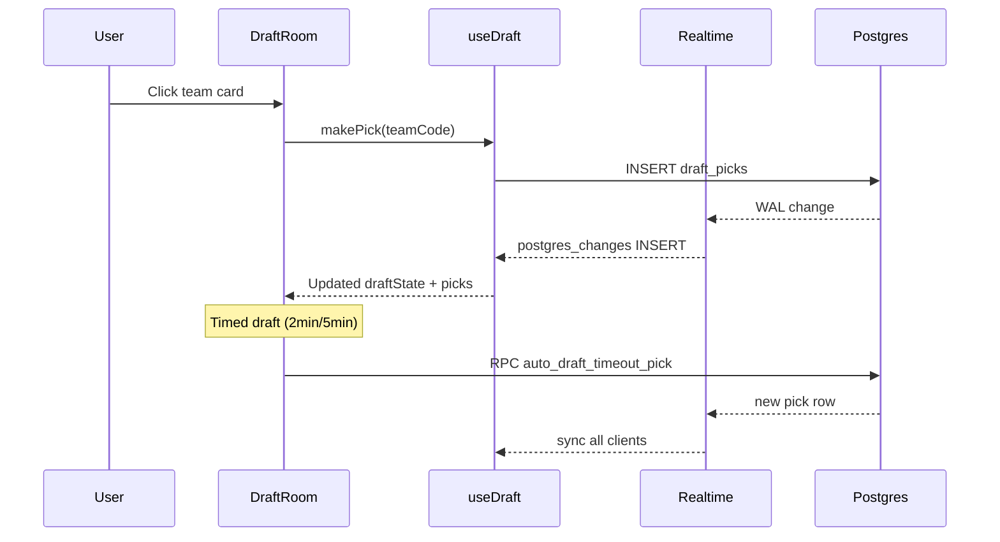
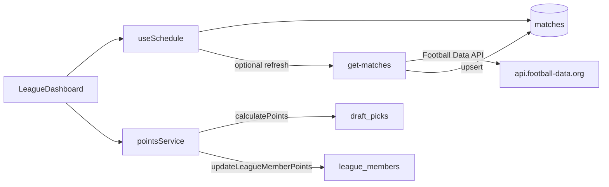
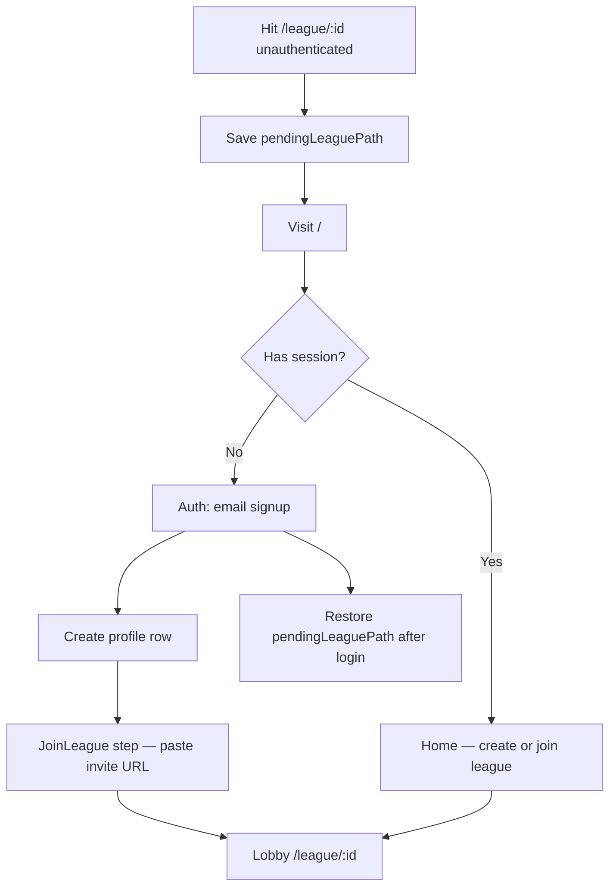

# World Cup Betting League — System Architecture

> Consolidated system design reference for the codebase at `src/` + `supabase/`.

---

## 1. System context



| Layer | Technology |
|-------|------------|
| Frontend | React 18, React Router 7, Vite, Tailwind CSS, Radix/shadcn UI |
| Client state | React hooks, Zustand (`store.ts` for draft prefs + static `TEAMS`) |
| Backend | Supabase Postgres, Auth, Realtime, Edge Functions |
| Sync | Supabase Realtime `postgres_changes` (WebSockets); reconnect on tab focus / channel errors |
| Hosting | Static SPA build (`vite build`); env vars `VITE_SUPABASE_URL`, `VITE_SUPABASE_ANON_KEY` |

---

## 2. Application routes & pages



| Route | Component | Purpose |
|-------|-----------|---------|
| `/` | `Home` + `Auth` | Sign up, create league, join league |
| `/league/:id` | `Lobby` | Waiting room, invite link, draft settings, start lottery |
| `/league/:id/lottery` | `Lottery` | Draft order lottery (host-driven animation) |
| `/league/:id/draft` | `DraftRoom` | Live snake draft (48 teams) |
| `/league/:id/dashboard` | `LeagueDashboard` | Standings, schedule, rosters, pot breakdown |

**Auth guard** (`routes.tsx` → `ProtectedRoute`):
- Checks `supabase.auth.getSession()`
- Unauthenticated users → redirect `/`, save path in `sessionStorage` (`pendingLeaguePath`)

---

## 3. Frontend module map



### Key files

| Path | Role |
|------|------|
| `src/lib/supabase.ts` | Supabase client singleton |
| `src/hooks/useLeague.ts` | `createLeague`, `joinLeague`, `fetchLeague`, `parseLeagueInput` |
| `src/hooks/useDraft.ts` | Draft state, picks, Realtime, `makePick`, `autoDraftTimeoutPick` |
| `src/hooks/useSchedule.ts` | Matches, picks, members for dashboard schedule tab |
| `src/lib/draftService.ts` | Pure snake-draft logic: `getCurrentPicker`, `makePick`, `isDraftComplete` |
| `src/lib/leagueFlow.ts` | `isLotteryPhase`, `isLotteryComplete` — navigation guards |
| `src/lib/pointsService.ts` | Win/draw/loss scoring → `league_members.total_points` |
| `src/app/store.ts` | Static `TEAMS[]` (48 World Cup teams), Zustand draft type prefs |
| `src/types/index.ts` | Shared TypeScript interfaces |

---

## 4. Database schema



**RLS**: All tables have Row Level Security enabled. Policies generally allow authenticated `SELECT` on league data; `INSERT`/`UPDATE` scoped to `auth.uid()`.

**Migrations** (`supabase/migrations/`):
- `001_init.sql` — core tables + base policies
- `add_profiles_insert_policy.sql`
- `add_league_update_policies.sql`
- `add_auto_draft_timeout_rpc.sql` — `auto_draft_timeout_pick` RPC

---

## 5. League lifecycle (`draft_status`)



### `draft_status` values

| Status | Phase | Typical screen |
|--------|-------|----------------|
| `pending` | Pre-draft | Lobby |
| `active` | Lottery starting | Redirect → Lottery |
| `lottery` | Host shuffling | Lottery |
| `lottery_order` | Revealing order | Lottery |
| `lottery_complete` | Order locked | Lottery → manual draft entry |
| `complete` | Post-tournament | Dashboard |

**Navigation guards** (`leagueFlow.ts`):
- `Lobby`: redirect to `/lottery` when `isLotteryPhase(status)`
- `Lottery`: redirect to `/league/:id` when not lottery phase
- `DraftRoom`: redirect to `/lottery` when lottery phase and not `lottery_complete`

---

## 6. Realtime architecture

All live sync uses **Supabase Realtime** (`postgres_changes` over WebSockets). No periodic HTTP polling.



| Channel | Table | Events | Component / Hook |
|---------|-------|--------|----------------|
| `league_members:{id}` | `league_members` | `INSERT` | `Lobby.tsx` |
| `leagues:{id}` | `leagues` | `UPDATE` | `Lobby.tsx` |
| `leagues_lottery:{id}` | `leagues` | `UPDATE` | `Lottery.tsx` |
| `draft-picks-{leagueId}` | `draft_picks` | `INSERT` | `useDraft.ts` |
| `league_members:{id}` | `league_members` | `*` | `LeagueDashboard.tsx` |

**Resilience** (event-driven, not polling):
- `useDraft`: `refreshDraft()` on channel `CHANNEL_ERROR` / `TIMED_OUT`, `online`, `visibilitychange`
- `Lottery`: one-shot `fetchLeague` on channel error

**Requirement**: Tables must be in the `supabase_realtime` publication (Supabase Dashboard → Database → Publications).

---

## 7. Draft system

### Snake draft rules

- **48 teams**, **6 or 8 members** → 8 or 6 picks per player
- **Odd rounds**: pick order `draft_position` 1 → N
- **Even rounds**: pick order N → 1
- Logic: `draftService.getCurrentPicker()`, `makePick()`

### Pick lookup (roster sidebar)

```ts
const getPickForMember = (round: number, member: LeagueMember) => {
  const memberCount = members.length;
  const isReverse = round % 2 === 0;
  const pos = member.draft_position - 1;
  const idx = isReverse ? memberCount - 1 - pos : pos;
  const pickNumber = (round - 1) * memberCount + idx + 1;
  return picks.find(p => p.pickNumber === pickNumber);
};
```

### Draft room flow



| Draft type | Timer | Timeout behavior |
|------------|-------|------------------|
| `untimed` | None | Manual picks only |
| `2min` | 120s | Auto-pick via RPC |
| `5min` | 300s | Auto-pick via RPC |

**Team data during draft**: Static `TEAMS` from `store.ts` (not loaded from `teams` table). Flags from `https://flagcdn.com/w20/{flagCode}.png`.

**Draft complete**: User clicks **Go to Dashboard** manually (no auto-redirect).

---

## 8. Lottery system

**Host-only** animation:
1. Host sets `draft_status: 'lottery'`
2. Host shuffles members → saves `draft_position` → `lottery_order`
3. Ball reveal animation (2s per slot)
4. Host auto-broadcasts `lottery_complete`
5. All clients see **Enter Draft Room** button (manual navigation)

**Non-host clients**: Sync via Realtime on `leagues` UPDATE → `handleLotteryStatus`.

---

## 9. Dashboard & scoring



### Scoring rules (`pointsService.ts`)

| Result | Points per owned team |
|--------|----------------------|
| Win | 3 |
| Draw | 1 |
| Loss | 0 |

Only `finished` matches with scores count.

### Dashboard tabs

- **Standings** — `total_points` from `league_members`
- **Schedule** — `matches` + user picks overlay, date pills, rivalry highlights
- **My Teams** — roster dropdown per member
- **Pot** — prize split logic (tournament winner, cinderella, etc.)

---

## 10. Auth & onboarding



| Step | Supabase operation |
|------|-------------------|
| Sign up | `supabase.auth.signUp` |
| Profile | `INSERT profiles` (username, color, icon) |
| Create league | `INSERT leagues` + host `league_members` |
| Join league | `INSERT league_members` via invite code |

---

## 11. Edge function: `get-matches`

**Path**: `supabase/functions/get-matches/index.ts`

| Input | `?matchday=N` (optional) |
| Output | JSON array of matches; upserts into `matches` table |
| External | `GET api.football-data.org/v4/competitions/WC/matches` |
| Secrets | `FOOTBALL_DATA_API_KEY`, `SUPABASE_SERVICE_ROLE_KEY` |

Called from `useSchedule.ts` via hardcoded function URL.

---

## 12. Environment & deployment

| Variable | Used by |
|----------|---------|
| `VITE_SUPABASE_URL` | `supabase.ts` |
| `VITE_SUPABASE_ANON_KEY` | `supabase.ts` |
| `FOOTBALL_DATA_API_KEY` | Edge function (server) |
| `SUPABASE_SERVICE_ROLE_KEY` | Edge function (server) |

**Build**: `npm run build` → static assets  
**Dev**: `npm run dev` (Vite)  
**Seed**: `npm run seed` → `scripts/seedTeams.js`

---

## 13. Security model

- **Auth**: Supabase JWT; all league routes behind `ProtectedRoute`
- **RLS**: Postgres policies enforce read/write boundaries per `auth.uid()`
- **Realtime**: Change delivery respects RLS per subscriber
- **RPC** `auto_draft_timeout_pick`: `SECURITY DEFINER`; validates league membership and current picker server-side
- **Client**: Anon key only in frontend; service role only in edge function

---

## 14. Known design decisions

| Decision | Rationale |
|----------|-----------|
| Static `TEAMS` in `store.ts` for draft UI | Fast flag cards, no DB round-trip during live draft |
| Realtime over polling | Lower latency, less Supabase load for 6–8 users |
| `draft_status` state machine | Reliable navigation; avoids `draft_position > 0` false positives on join |
| Manual dashboard navigation after draft | User controls when to leave draft room |
| Host-driven lottery | Single source of truth for shuffle order |
| Football Data via edge function | API key stays server-side; matches cached in Postgres |

---

## 15. Directory structure (high level)

```
src/
├── app/
│   ├── components/     # Pages + shadcn UI
│   ├── routes.tsx      # Router + auth guard
│   └── store.ts        # TEAMS + Zustand
├── hooks/              # useLeague, useDraft, useSchedule
├── lib/                # supabase, draftService, leagueFlow, pointsService
├── types/              # Shared interfaces
└── styles/             # Tailwind entry

supabase/
├── migrations/         # SQL schema + RLS + RPC
├── functions/          # get-matches edge function
└── config.toml

docs/
└── ARCHITECTURE.md     # This file
```

---

*Last updated from codebase state: main branch, Realtime-only sync (polling removed).*
